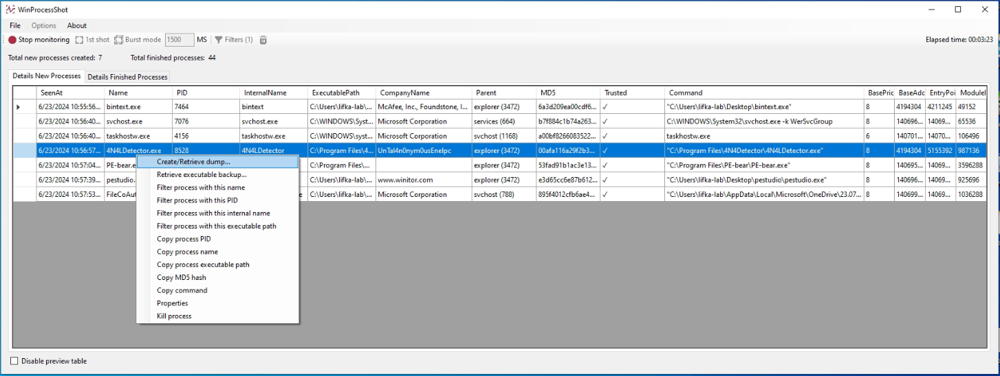

# WinProcessShot
 WinProcessShot is a simple and portable monitoring Windows processes tool for malware analysis. Its purpose is to show the processes that are created and terminated in the system during a period of time, recording certain information about them.

## Features
 * Monitor created and finished processes. Three modes of use: monitoring, burst mode, and compare two different time instants.
 * Create memory dumps of new processes.
 * Recover a memory dump from a process that is no longer running.
 * Recover a sample that was captured running in the system and no longer exists.
 * Verify if a process has a valid signature or its hash is registered.
 * Filter processes.
 * Export results in JSON format.

## Screenshots

## Copyright
© 2024 Copyright: [javierizquierdovera.com](https://javierizquierdovera.com/).
This program is free software, you can redistribute it and/or modify it under the terms of [GPLv2](https://www.gnu.org/licenses/old-licenses/gpl-2.0.html).